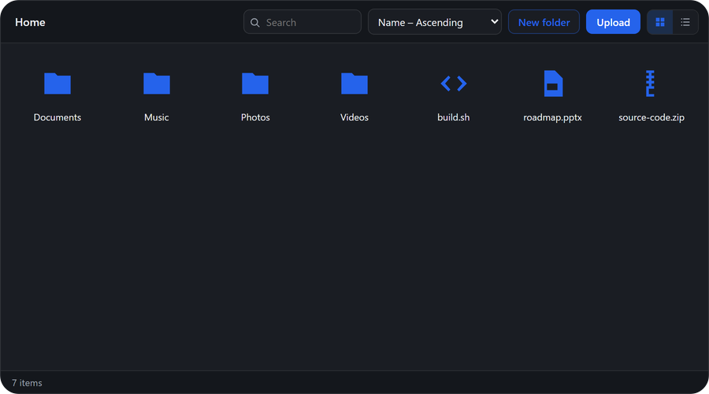

<p align="center">
  
</p>

<h1 align="center">Neiki's File Manager</h1>

<p align="center">
  
  
  
  
  <br>
  
  
</p>

<p align="center">
  <b>Lightweight, CDN-ready File Manager Web Component</b><br>
  <i>Zero dependencies, framework-independent, drop into any page.</i>
</p>

<p align="center">
  
  
  
  
</p>

---

<p align="center">
  
</p>

---

**Live version:** [https://neikiri.dev/file-manager](https://neikiri.dev/file-manager)

---

## Overview

Neiki's File Manager is a Web Component written in plain JavaScript with **zero dependencies**. Drop a single `<neiki-file-manager>` tag onto a page and get an accessible, themeable, fully keyboard-navigable file browser — grid or list view, drag & drop upload, previews, folders, rename, and a context menu — with no framework, bundler, or build step required.

```html
<script src="https://cdn.neikiri.dev/neiki-file-manager/neiki-file-manager.min.js"></script>

<neiki-file-manager id="fm"></neiki-file-manager>
<script>
  document.getElementById('fm').setData([
    { id: 'photos', name: 'Photos', type: 'folder', parent: null },
    { id: 'readme', name: 'readme.md', type: 'file', size: 2048, parent: null }
  ]);
</script>
```

That snippet is a complete, working file manager. From there you can configure the view mode, theme, language, and wire up uploads, renames, deletes and moves to your own backend through a small set of cancelable events.

---

## Why Neiki's File Manager?

- **One script, no dependencies.** The component ships as a single custom element. No React, Vue, Svelte, or Angular required — it works in plain HTML just as well as inside any framework.
- **CDN-ready.** Load it from jsDelivr or unpkg and start using `<neiki-file-manager>` immediately.
- **Backend-agnostic by design.** The component owns an in-memory, flat file/folder model (`id` + `parent` references). Every mutation — upload, rename, delete, move — first dispatches a cancelable event; call `preventDefault()` in your own handler to talk to a real API instead of the built-in default behavior.
- **Grid and list views.** Switch instantly with the toolbar or `setView()`, each with its own layout, sorting, and keyboard navigation.
- **Real drag & drop.** Drop files from the desktop to upload (with instant object-URL previews for images/audio/video), and drag items onto folders to move them, including cross-folder validation that blocks dropping a folder into its own descendant.
- **Built-in preview.** Images, video, audio and PDFs preview inline in a modal; everything else falls back to a clean metadata + download view.
- **Internationalized out of the box.** English, Czech, German, Spanish, French, Polish, Slovak and Ukrainian translations ship with the component; add or override any language with `addTranslations()`.
- **Accessible by design.** Semantic buttons and links, keyboard shortcuts for every action (arrows, Enter, F2, Delete, Ctrl/Cmd+A/C/X/V, Escape), visible focus states, and reduced-motion awareness.
- **Secure by default.** All dynamic content (file names, translations, search input) is HTML-escaped before being rendered; the component never fetches, uploads, or deletes anything on its own unless your code lets the default event behavior run.

---

## Getting started

The recommended install is the single bundled script from the CDN.

```html
<script src="https://cdn.neikiri.dev/neiki-file-manager/neiki-file-manager.min.js"></script>
```

<details>
<summary><b>Other installation options</b> (pinned version, jsDelivr, unpkg, npm, self-hosted)</summary>
<br>

**Pin a specific version (recommended for production)**

```html
<script src="https://cdn.neikiri.dev/neiki-file-manager/1.0.1/neiki-file-manager.min.js"></script>
```

**Load CSS and JS separately**

```html
<!-- Latest -->
<link rel="stylesheet" href="https://cdn.neikiri.dev/neiki-file-manager/neiki-file-manager.css">
<script src="https://cdn.neikiri.dev/neiki-file-manager/neiki-file-manager.js"></script>

<!-- Or pinned -->
<link rel="stylesheet" href="https://cdn.neikiri.dev/neiki-file-manager/1.0.1/neiki-file-manager.css">
<script src="https://cdn.neikiri.dev/neiki-file-manager/1.0.1/neiki-file-manager.js"></script>
```

**Alternative CDN — jsDelivr**

```html
<script src="https://cdn.jsdelivr.net/npm/neiki-file-manager@latest/dist/neiki-file-manager.min.js"></script>
<!-- Pinned -->
<script src="https://cdn.jsdelivr.net/npm/neiki-file-manager@1.0.1/dist/neiki-file-manager.min.js"></script>
```

**Alternative CDN — unpkg**

```html
<script src="https://unpkg.com/neiki-file-manager@1.0.1/dist/neiki-file-manager.min.js"></script>
```

**Package manager**

```bash
npm install neiki-file-manager
# or
yarn add neiki-file-manager
# or
pnpm add neiki-file-manager
```

**Self-hosted**

```html
<script src="path/to/dist/neiki-file-manager.min.js"></script>
```

The built `dist/neiki-file-manager.min.js` bundles its CSS inline — one file is all you need, no separate stylesheet to keep track of. `dist/neiki-file-manager.css` and `.min.css` are also published for reference (e.g. to preview the default styles or diff a customization), but the component never fetches them at runtime.

</details>

---

## Basic usage

```html
<neiki-file-manager
  id="fm"
  view="grid"
  theme="auto"
  lang="en"
  selectable="multiple"
></neiki-file-manager>

<script>
  var fm = document.getElementById('fm');

  fm.setData([
    { id: 'documents', name: 'Documents', type: 'folder', parent: null },
    { id: 'photos', name: 'Photos', type: 'folder', parent: null },
    { id: 'readme', name: 'readme.md', type: 'file', size: 2048, mime: 'text/markdown', parent: null },
    { id: 'contract', name: 'contract.pdf', type: 'file', size: 184000, mime: 'application/pdf', parent: 'documents', url: '/files/contract.pdf' }
  ]);
</script>
```

Each data item is a plain object:

| Field | Type | Notes |
|-------|------|-------|
| `id` | string | Unique identifier. Auto-generated if omitted. |
| `name` | string | Display name. |
| `type` | `'file'` \| `'folder'` | Determines icon, and whether it can be navigated into. |
| `parent` | string \| `null` | `id` of the parent folder, or `null` for the root. |
| `size` | number | Bytes. Files only. |
| `mime` | string | Optional MIME type, shown in preview metadata. |
| `modified` | number | Timestamp (ms). Defaults to "now" if omitted. |
| `url` | string | Optional URL used for preview (image/video/audio/PDF) and download. |
| `thumbnail` | string | Optional thumbnail URL for the grid view. Defaults to `url` for images. |

---

## Uploads without a backend

Drop files onto the component, or use the toolbar's upload button — by default, dropped/selected files are added straight into the model, with an automatic `URL.createObjectURL()` preview for images, audio and video. No server required to try it out:

```html
<neiki-file-manager id="fm"></neiki-file-manager>
```

To hook up a real backend instead, listen for the cancelable `upload` event and take over:

```javascript
fm.addEventListener('neiki-file-manager:upload', function (event) {
  event.preventDefault(); // stop the built-in "just add the file" behavior

  var files = event.detail.files;      // File[]
  var parentId = event.detail.parentId; // folder the files were dropped into

  uploadToServer(files, parentId).then(function (uploaded) {
    fm.addFiles(uploaded, parentId); // reflect the server's response in the UI
  });
});
```

`rename`, `delete`, and `move` follow the same pattern — cancelable, with the component's own in-memory model as the default fallback.

---

## JavaScript API

```javascript
var fm = document.querySelector('neiki-file-manager');

// Data
fm.setData(items);          // replace the entire data set
fm.getData();                // full flat array of items
fm.addItems(items);          // append raw items
fm.addFiles(fileList, parentId); // add File objects (or plain metadata) as file nodes
fm.removeItems(ids);          // delete by id (cancelable via the `delete` event)
fm.renameItem(id, newName);   // rename (cancelable via the `rename` event)
fm.createFolder(name, parentId);
fm.moveItems(ids, targetParentId); // cancelable via the `move` event

// Navigation
fm.navigateTo(folderId);      // null navigates to the root
fm.getPath();                  // array of folders from root to current

// Selection
fm.getSelection();             // array of selected ids
fm.setSelection(ids);
fm.selectAll();

// View & config
fm.setView('grid' | 'list');
fm.getView();
fm.setConfig({ theme: 'dark', sortBy: 'size', sortDir: 'desc' });
fm.getConfig();

// i18n
fm.setLang('cs');
fm.addTranslations('en', { toolbar: { upload: 'Send files' } });

// Preview
fm.openPreview(id);
fm.closePreview();

fm.refresh(); // re-render from current state
```

---

## Events

All events bubble and are composed (cross Shadow DOM boundary), with details on `event.detail`. Events marked **cancelable** call `event.preventDefault()` to suppress the component's default local-model behavior.

| Event | Fired when | `detail` | Cancelable |
|-------|------------|----------|:---:|
| `neiki-file-manager:ready` | The component finished its first render | `{ config }` | |
| `neiki-file-manager:navigate` | The current folder changes | `{ folderId }` | |
| `neiki-file-manager:select` | The selection changes | `{ ids }` | |
| `neiki-file-manager:open` | A file is opened (double-click / Enter) | `{ item }` | |
| `neiki-file-manager:contextmenu` | The context menu opens | `{ item \| null }` | |
| `neiki-file-manager:upload` | Files are dropped or chosen | `{ files, parentId }` | ✅ |
| `neiki-file-manager:rename` | An item is renamed | `{ id, oldName, newName }` | ✅ |
| `neiki-file-manager:delete` | Items are about to be removed | `{ ids }` | ✅ |
| `neiki-file-manager:move` | Items are dragged onto a folder | `{ ids, targetParentId }` | ✅ |
| `neiki-file-manager:create-folder` | A folder is created | `{ item }` | |
| `neiki-file-manager:change` | The underlying data set changed | `{ items }` | |

```javascript
fm.addEventListener('neiki-file-manager:delete', function (event) {
  console.log('deleting', event.detail.ids);
});
```

---

## Attributes

| Attribute | Values | Default | Description |
|-----------|--------|---------|--------------|
| `view` | `grid`, `list` | `grid` | Layout mode |
| `theme` | `light`, `dark`, `auto` | `auto` | Visual theme |
| `lang` | `en`, `cs`, `de`, `es`, `fr`, `pl`, `sk`, `uk` | `en` | Interface language |
| `selectable` | `single`, `multiple`, `none` | `multiple` | Selection mode |
| `root-label` | string | *(translated "Home")* | Label for the root breadcrumb |

---

## Keyboard shortcuts

| Keys | Action |
|------|--------|
| Click / Ctrl(Cmd)+click / Shift+click | Select / toggle / range-select |
| Enter | Open the selected item |
| F2 | Rename the selected item |
| Delete / Backspace | Delete the selection (with confirmation) |
| Ctrl(Cmd)+A | Select all items in the current folder |
| Ctrl(Cmd)+C / X / V | Copy / cut / paste |
| Escape | Close the context menu or preview |

---

## CSS variables

All variables use the `--nfm-*` prefix and can be overridden per instance or globally:

```css
neiki-file-manager {
  --nfm-height: 480px;
  --nfm-radius: 12px;
  --nfm-accent: #7c3aed;
  --nfm-bg: #ffffff;
  --nfm-color: #1f2328;
}
```

| Variable | Purpose |
|----------|---------|
| `--nfm-height` | Overall component height |
| `--nfm-radius` / `--nfm-radius-sm` | Container / inner element border radius |
| `--nfm-gap` | Spacing between toolbar controls |
| `--nfm-font-size` | Base font size |
| `--nfm-transition` | Transition timing |
| `--nfm-shadow` | Menu and preview modal box-shadow |
| `--nfm-bg` / `--nfm-bg-subtle` / `--nfm-bg-hover` | Background layers |
| `--nfm-color` / `--nfm-color-muted` | Text colors |
| `--nfm-border` | Border color |
| `--nfm-accent` / `--nfm-accent-contrast` | Accent color and its contrasting text/icon color |
| `--nfm-selected-bg` / `--nfm-selected-border` | Selected item styling |
| `--nfm-focus-ring` | Keyboard focus ring color |
| `--nfm-danger` | Destructive-action color |

---

## Internationalization

Eight languages ship built in: English (`en`), Czech (`cs`), German (`de`), Spanish (`es`), French (`fr`), Polish (`pl`), Slovak (`sk`) and Ukrainian (`uk`).

```html
<neiki-file-manager lang="cs"></neiki-file-manager>
```

```javascript
fm.setLang('uk');
```

Add a new language, or override strings in an existing one, with `addTranslations()`:

```javascript
fm.addTranslations('it', {
  toolbar: { newFolder: 'Nuova cartella', upload: 'Carica', search: 'Cerca' },
  breadcrumb: { home: 'Home' },
  menu: { open: 'Apri', rename: 'Rinomina', delete: 'Elimina', /* … */ },
  status: { empty: 'Questa cartella è vuota' }
});
fm.setLang('it');
```

Only the keys you pass are merged in — omitted keys fall back to English.

---

## Accessibility

- Every interactive control (toolbar buttons, breadcrumbs, context menu, view toggle) is a real `<button>` — no `div`-as-button anti-patterns.
- Full keyboard navigation and shortcuts for select, open, rename, delete and clipboard actions.
- Visible `:focus-visible` outlines on every interactive element.
- `prefers-reduced-motion: reduce` disables transitions.
- Colors default to sufficient contrast in both light and dark themes.

---

## Security

- The component renders inside a Shadow DOM, isolating its markup and styles from the host page.
- All dynamic text (names, translations, search terms) is HTML-escaped before being rendered.
- The component performs no network requests of its own. Uploads, renames, deletes and moves only ever mutate the local in-memory model unless your own event handler calls `preventDefault()` and does something different — it never talks to a server unless you wire that up.
- Object URLs created for local previews are tracked and revoked automatically when the component is disconnected or its data set is replaced.

See [SECURITY.md](SECURITY.md) for the full policy and how to report vulnerabilities.

---

## Demo

Open [`demo/index.html`](demo/index.html) in a browser (or serve the repo locally) to see grid/list views, themes, i18n, drag & drop upload with live preview, and the full JavaScript API in action.

---

## Build / minify

```bash
npm run build
```

Runs [`minify.py`](minify.py), which reads `src/neiki-file-manager.js` and `src/neiki-file-manager.css` and produces:

```
dist/neiki-file-manager.js       # CSS embedded inline, unminified
dist/neiki-file-manager.min.js   # CSS embedded inline, minified (recommended)
dist/neiki-file-manager.css      # standalone copy, for reference
dist/neiki-file-manager.min.css  # standalone copy, for reference
```

The CSS is baked directly into both JavaScript bundles at build time — loading either `dist` script is enough on its own, no separate stylesheet request required. JS minification uses [Terser](https://github.com/terser/terser) via `npx` when available, falling back to an unminified copy otherwise.

```bash
npm test
```

Runs `node --check` against the source file as a syntax sanity check.

---

## Browser support

Neiki's File Manager uses Custom Elements v1, Shadow DOM, and standard DOM APIs, and targets current versions of modern browsers.

| Browser | Support |
|---------|---------|
| Chrome | Latest |
| Firefox | Latest |
| Safari | Latest |
| Edge | Latest |

> Internet Explorer is not supported.

---

## Contributing

Contributions are welcome. Please review [CONTRIBUTING.md](CONTRIBUTING.md) and the [CODE_OF_CONDUCT.md](CODE_OF_CONDUCT.md) before opening an issue or pull request. Security-related reports should follow [SECURITY.md](SECURITY.md).

The component source lives in `src/` (`neiki-file-manager.js`, `neiki-file-manager.css`); the distributable builds are in `dist/`.

---

## License

Released under the **MIT License**. See the [LICENSE](LICENSE) file for details.

---

<p align="center">
  Made with ❤️ for the web community
</p>
